# 必应壁纸信息收集器 (Bing Wallpaper Information Collector)

[](https://github.com/hippieZhou/BingWallpaperCollector/actions/workflows/collect-wallpapers.yml)
[](https://github.com/hippieZhou/BingWallpaperCollector/actions/workflows/collect-regional-wallpapers.yml)


基于 C# 和 .NET 9.0 开发的多语言必应壁纸信息收集工具，支持 14 个国家/地区的本地化壁纸信息收集。

> **🤖 全自动收集**: 项目已集成 GitHub Actions，每天自动收集全球 Bing 壁纸信息，无需人工干预！

## 功能特性

- 🤖 **GitHub Actions 自动化** - 每天自动收集，多时区优化，自动提交数据
- 🌍 **多语言支持** - 支持 14 个国家/地区的本地化内容
- 📊 **JSON 数据存储** - 保存完整的壁纸信息而非下载图片
- 🖼️ **多分辨率 URL** - 提供 UHD、4K、1080p、HD 四种分辨率链接
- 📅 **历史数据收集** - 支持收集最近 8 天的历史壁纸信息
- 📁 **智能目录结构** - 按国家和日期组织数据文件
- ⚡ **并发处理** - 支持多线程并发收集，提高效率
- 🔄 **重复检测** - 避免重复收集相同的数据
- 📋 **详细日志** - 完整的操作日志记录
- 🎛️ **双模式运行** - 支持交互式和自动化无人值守运行

## 支持的国家/地区

| 编号 | 国旗 | 国家/地区 | 市场代码 | 语言     |
| ---- | ---- | --------- | -------- | -------- |
| 01   | 🇨🇳   | 中国      | zh-CN    | 中文     |
| 02   | 🇺🇸   | 美国      | en-US    | 英文     |
| 03   | 🇬🇧   | 英国      | en-GB    | 英文     |
| 04   | 🇯🇵   | 日本      | ja-JP    | 日文     |
| 05   | 🇩🇪   | 德国      | de-DE    | 德文     |
| 06   | 🇫🇷   | 法国      | fr-FR    | 法文     |
| 07   | 🇪🇸   | 西班牙    | es-ES    | 西班牙文 |
| 08   | 🇮🇹   | 意大利    | it-IT    | 意大利文 |
| 09   | 🇷🇺   | 俄罗斯    | ru-RU    | 俄文     |
| 10   | 🇰🇷   | 韩国      | ko-KR    | 韩文     |
| 11   | 🇧🇷   | 巴西      | pt-BR    | 葡萄牙文 |
| 12   | 🇦🇺   | 澳大利亚  | en-AU    | 英文     |
| 13   | 🇨🇦   | 加拿大    | en-CA    | 英文     |
| 14   | 🇮🇳   | 印度      | en-IN    | 英文     |

## 项目架构

本项目采用现代化的分层架构设计，基于 SOLID 原则和 .NET 最佳实践进行重构：

### 架构总览图

```mermaid
graph TB
    subgraph "🏗️ Application Layer"
        Program["Program.cs<br/>程序入口点<br/>依赖注入配置"]
        App["BingWallpaperApp.cs<br/>主应用协调器<br/>服务编排"]
    end

    subgraph "🔧 Service Layer"
        subgraph "Interfaces"
            IWallpaper["IBingWallpaperService<br/>壁纸收集接口"]
            IDownload["IImageDownloadService<br/>图片下载接口"]
            IStorage["IWallpaperStorageService<br/>存储服务接口"]
            IConfig["IUserConfigurationService<br/>配置服务接口"]
        end

        subgraph "Implementations"
            WallpaperSvc["BingWallpaperService<br/>壁纸收集实现<br/>API调用逻辑"]
            DownloadSvc["ImageDownloadService<br/>图片下载实现<br/>并发下载管理"]
            StorageSvc["WallpaperStorageService<br/>存储服务实现<br/>JSON序列化"]
            ConfigSvc["UserConfigurationService<br/>配置服务实现<br/>环境变量处理"]
        end
    end

    subgraph "🏛️ Model Layer"
        subgraph "Data Models"
            M1["BingWallpaperInfo<br/>API响应模型"]
            M2["WallpaperTimeInfo<br/>时间信息模型<br/>DateOnly支持"]
            M3["WallpaperInfoStorage<br/>存储数据模型"]
            M4["ImageResolution<br/>分辨率信息"]
        end

        subgraph "Progress Models"
            P1["FileDownloadProgress<br/>单文件下载进度"]
            P2["BatchDownloadProgress<br/>批量下载进度"]
            P3["ImageDownloadRequest<br/>下载请求模型"]
        end

        subgraph "API Models"
            A1["BingApiResponse<br/>API响应封装"]
        end
    end

    subgraph "🎯 Enums & Extensions"
        E1["MarketCode<br/>市场代码枚举<br/>14个国家/地区"]
        E2["DownloadStatus<br/>下载状态枚举"]
        EX1["EnumExtensions<br/>枚举扩展方法<br/>Description获取"]
    end

    subgraph "⚙️ Configuration"
        C1["AppConstants<br/>应用常量<br/>API地址、超时等"]
        C2["CollectionConfig<br/>收集配置模型"]
        CV1["WallpaperTimeInfoConverter<br/>JSON时间转换器<br/>DateOnly序列化"]
    end

    subgraph "🌐 External Systems"
        EXT1["Bing Wallpaper API<br/>https://www.bing.com/<br/>HPImageArchive.aspx"]
        EXT2["本地文件系统<br/>BingWallpaperData/<br/>Country/Date/结构"]
        EXT3["GitHub Actions<br/>自动化工作流<br/>定时收集"]
    end

    %% 应用层连接
    Program --> App
    App --> IWallpaper
    App --> IDownload

    %% 接口实现连接
    IWallpaper -.-> WallpaperSvc
    IDownload -.-> DownloadSvc
    IStorage -.-> StorageSvc
    IConfig -.-> ConfigSvc

    %% 服务依赖关系
    WallpaperSvc --> IStorage
    WallpaperSvc --> IConfig
    WallpaperSvc --> EXT1

    %% 存储服务使用模型
    StorageSvc --> M1
    StorageSvc --> M2
    StorageSvc --> M3
    StorageSvc --> CV1
    StorageSvc --> EXT2

    %% 下载服务使用模型
    DownloadSvc --> P1
    DownloadSvc --> P2
    DownloadSvc --> P3
    DownloadSvc --> E2

    %% 配置服务使用枚举
    ConfigSvc --> E1
    ConfigSvc --> EX1
    ConfigSvc --> C1
    ConfigSvc --> C2

    %% API调用关系
    WallpaperSvc --> A1
    A1 --> M1

    %% 外部触发
    EXT3 --> Program

    %% 样式定义
    classDef appClass fill:#90EE90,stroke:#333,stroke-width:3px,color:#000
    classDef serviceClass fill:#87CEEB,stroke:#333,stroke-width:2px,color:#000
    classDef interfaceClass fill:#E8F4FD,stroke:#333,stroke-width:2px,color:#000
    classDef modelClass fill:#DDA0DD,stroke:#333,stroke-width:2px,color:#000
    classDef enumClass fill:#F0E68C,stroke:#333,stroke-width:2px,color:#000
    classDef configClass fill:#FFE4B5,stroke:#333,stroke-width:2px,color:#000
    classDef externalClass fill:#FFB6C1,stroke:#333,stroke-width:3px,color:#000

    class Program,App appClass
    class WallpaperSvc,DownloadSvc,StorageSvc,ConfigSvc serviceClass
    class IWallpaper,IDownload,IStorage,IConfig interfaceClass
    class M1,M2,M3,M4,P1,P2,P3,A1 modelClass
    class E1,E2,EX1 enumClass
    class C1,C2,CV1 configClass
    class EXT1,EXT2,EXT3 externalClass
```



### 架构特点

#### 🎯 **分层设计**

- **应用层**: 轻量级协调器，负责应用程序启动和服务协调
- **服务层**: 清晰的接口定义与实现分离，支持依赖注入和单元测试
- **模型层**: 类型安全的数据模型，支持 JSON 序列化和自定义转换
- **配置层**: 集中管理常量、配置和扩展方法

#### 🔧 **技术特性**

- **SOLID 原则**: 单一职责、开放封闭、依赖倒置等原则的完整实现
- **依赖注入**: 完整的 DI 容器配置，支持服务生命周期管理
- **现代 C#**: 使用 `sealed` 类、集合表达式 `[]`、`Span<T>` 等现代语法
- **类型安全**: `DateOnly` 类型处理日期，自定义 JSON 转换器
- **异步编程**: 全面的 `async/await` 支持，包含 `CancellationToken`

#### 📦 **可扩展性**

- **接口驱动**: 所有核心功能通过接口定义，便于扩展和替换实现
- **模块化设计**: 27 个专业组织的文件，从原来的单个 1399 行巨大文件重构而来
- **测试友好**: 每个服务都可独立进行单元测试和集成测试
- **跨平台兼容**: 支持 WinUI3、控制台应用等多种宿主环境

## 系统要求

- .NET 9.0 或更高版本
- Windows、macOS 或 Linux
- 稳定的网络连接

## 快速开始

### 1. 克隆或下载项目

```bash
git clone git@github.com:hippieZhou/BingWallpaperCollector.git
cd BingWallpaperCollector
```

### 2. 恢复依赖包

```bash
dotnet restore
```

### 3. 运行程序

```bash
dotnet run
```

### 4. 发布可执行文件

```bash
# 发布为独立可执行文件（包含运行时）
dotnet publish -c Release -r win-x64 --self-contained true -p:PublishSingleFile=true

# 发布为框架依赖（需要安装.NET运行时）
dotnet publish -c Release
```

## 配置选项

程序运行时支持以下交互式配置：

### 1. 收集模式选择

- **单个国家/地区**: 选择特定国家进行数据收集
- **所有支持的国家/地区**: 收集所有 14 个国家的数据

### 2. 历史天数设置

- 支持收集 1-8 天的历史数据
- 默认收集 1 天（今日）

### 3. 并发请求数

- 支持 1-5 个并发请求
- 默认 3 个并发，平衡速度和服务器负载

### 4. JSON 格式选择

- **美化格式**: 易于阅读，文件较大
- **压缩格式**: 节省空间，文件较小

## API 接口

程序使用必应官方的壁纸 API：

- **API 地址**: `https://www.bing.com/HPImageArchive.aspx?format=js&idx={dayIndex}&n=1&mkt={marketCode}`
- **支持参数**:
  - `idx`: 天数索引（0=今天，1=昨天，最大 7）
  - `mkt`: 市场代码（如 zh-CN、en-US、ja-JP 等）
  - `n`: 获取图片数量（通常为 1）

## 使用示例

```bash
# 运行程序
dotnet run

# 交互式输出示例
=== 必应壁纸信息收集器配置 ===

请选择收集模式:
1. 单个国家/地区
2. 所有支持的国家/地区
请输入选择 (1-2) [默认: 1]: 1

支持的国家/地区:
01. China (zh-CN)
02. UnitedStates (en-US)
03. UnitedKingdom (en-GB)
04. Japan (ja-JP)
...
请选择国家/地区 (1-14) [默认: 1-中国]: 4

请输入要收集的历史天数 (1-8) [默认: 1]: 3
请输入并发请求数 (1-5) [默认: 3]: 3

请选择JSON格式:
1. 美化格式（易读）
2. 压缩格式（占用空间小）
请输入选择 (1-2) [默认: 1]: 1

# 程序执行输出
=== 开始收集必应壁纸信息 ===
配置信息:
  - 目标国家: Japan
  - 历史天数: 3 天
  - 并发请求: 3 个
  - JSON格式: 美化
================================

开始为 Japan (ja-JP) 收集 3 天的历史壁纸信息...
✓ Japan - 2025-08-27 - 今日は世界湖沼の日
✓ Japan - 2025-08-26 - 驚くべき...
✓ Japan - 2025-08-25 - 火山から...
Japan 的壁纸信息收集完成

所有壁纸信息收集完成！
数据存储目录: /path/to/BingWallpaperData
```

## 技术特点

### 多语言本地化

- 使用正确的 HTTP 请求头 (`Accept-Language`) 获取对应语言内容
- 自动处理不同国家的标题、描述和版权信息的本地化

### URL 智能处理

- 自动修正图片 URL 中的市场代码
- 根据国家代码生成一致的图片标识符
- 提供多种分辨率的图片链接

### 并发控制

- 使用信号量控制 API 请求频率
- 避免对必应服务器造成过大压力
- 支持用户自定义并发数量

## 常见问题

### Q: 为什么某些国家的内容还是显示英文？

A: 某些国家/地区可能没有完全本地化的内容，必应会返回英文作为默认语言。

### Q: 如何修改数据存储目录？

A: 可以在 `App.cs` 中修改 `_dataDirectory` 的初始化代码。

### Q: 支持更多国家吗？

A: 可以在 `MarketCode` 枚举中添加更多国家代码，但需要确保必应 API 支持该市场。

### Q: 如何实现自动化收集？

A: 项目已集成 GitHub Actions 自动化收集功能！

- 🤖 **每日自动运行** - 无需手动干预
- 🌍 **多时区优化** - 覆盖全球 14 个国家
- 📊 **智能重试机制** - 避免并发冲突
- 🔄 **自动提交数据** - 持续更新仓库

详细配置和使用方法请查看 [GitHub Actions 文档](.github/README.md)。

**本地自动化:**

```bash
# 设置环境变量实现非交互模式
export AUTO_MODE=true
export COLLECT_ALL_COUNTRIES=true
dotnet run
```

### Q: JSON 文件可以用于什么用途？

A: 可以用于构建壁纸应用、网站展示、数据分析、或者作为其他应用的数据源。

### Q: 当前系统运行状况如何？

A: 🎉 **系统运行完全正常！** GitHub Actions 自动化流程稳定运行，数据持续更新。

详细的运行状态和收集报告请查看 [GitHub Actions 文档](.github/README.md)。

### Q: 如何验证图片 URL 是否可用？

A: 项目中的所有图片 URL 都经过实际 HTTP 测试验证：

```bash
# 例如测试UHD格式
curl -I "https://www.bing.com/th?id=OHR.FaroeLake_ZH-CN3977660997_UHD.jpg"
# 返回: HTTP/2 200, Content-Length: 3628316 (约3.6MB)
```

每个分辨率都确保可以正常下载使用。

## 许可证

本项目采用 MIT 许可证，详情请参阅 LICENSE 文件。

## 作者

**主要开发者:**

- [@hippieZhou](https://github.com/hippieZhou) - 项目创建者和维护者

**Co-Author:**

- [Cursor](https://cursor.sh/) - AI 编程助手，协助项目开发和优化

## 贡献

欢迎提交 Issue 和 Pull Request！

## 更新日志

### v2.2.0 (当前版本) - 架构重构版本

- 🏗️ **全面架构重构**: 从单个 1399 行文件重构为 27 个专业组织的模块化文件
- 🎯 **SOLID 原则实践**: 完整实现单一职责、开放封闭、依赖倒置等设计原则
- 🔧 **依赖注入架构**: 完整的 DI 容器配置，支持服务生命周期管理
- 📦 **服务分层设计**: Services 接口与 Impl 实现清晰分离，提升可维护性
- 🚀 **现代 C#特性**: 使用 `sealed` 类、集合表达式 `[]`、`Span<T>` 等最新语法
- 📋 **类型安全增强**: `DateOnly` 类型处理日期，自定义 JSON 转换器
- 🧪 **测试友好设计**: 每个服务可独立进行单元测试和集成测试
- 🔄 **异步编程优化**: 全面的 `async/await` 支持，包含 `CancellationToken`
- 📊 **常量管理优化**: AppConstants 集中管理，消除 27 处魔法数字
- 🌐 **跨平台兼容**: 支持 WinUI3、控制台应用等多种宿主环境集成
- 🎨 **项目架构图**: 新增完整的 Mermaid 架构图展示项目结构

### v2.1.0

- 🎯 **修复关键问题**: 修正图片 URL 生成逻辑，确保所有 URL 可用
- 🔧 **GitHub Actions 完善**: 解决并发推送冲突，优化自动化流程
- 📋 **调试工具增强**: 改进日志输出，添加详细的状态反馈
- 🌍 **全球自动收集**: 成功实现 14 个国家的自动化数据收集
- 🖼️ **分辨率优化**: 基于实际测试确定可用格式（UHD、HD、Full HD、Standard）
- 📊 **数据完整性**: 修复.gitignore 问题，确保数据正确提交和存储

### v2.0.0

- 🔄 **重大更新**: 从壁纸下载器转换为壁纸信息收集器
- 🌍 新增多语言支持（14 个国家/地区）
- 📊 JSON 数据存储替代图片下载
- 🖼️ 多分辨率 URL 支持（UHD、4K、1080p、HD）
- 📅 历史数据收集功能（最多 8 天）
- 📁 智能目录结构（按国家和日期组织）
- ⚡ 并发处理和性能优化
- 🎨 交互式用户界面
- 🤖 GitHub Actions 自动化收集

### v1.0.0

- 初始版本发布
- 支持必应壁纸自动下载
- 支持 4K 和 HD 分辨率
- 完整的错误处理和日志记录
